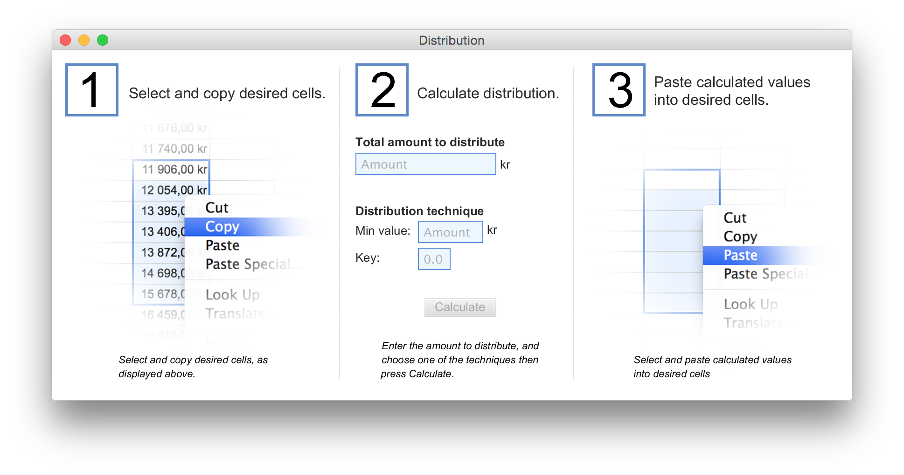

# Distribution
An application to distribute expenses over a set number of stores in a merchant chain, based on their yearly revenue.

# About
This applikation is specialy created and desigen for a single purpose, it's was never created for the common public.

# How To Do
The application is devided in to three steps.

1. First you copy the revenue of the desired companies, of which to devide the expens betweene.
2. Enter the amount to distribute and what distribution algorithm to use, and hitt calculate.
3. Go back to the spreadsheet and paste the values of what each company should pay based on their revenue.

# How it works
I use the data copied form the spreadsheet in to the clipboard, and when the calculation is complete I set the clipboard to the new values, this way the user only need to select, copy, enter amount and paste, very simple.

Method 1 - Min value:
This method calulates how much each company should pay to fully pay the specified expense while at the same time keeping the distribution of the lowest paying company at the entered minimum value.

Method 2 - Key:
In this method the user specifies how much the most paying company will pay compared to the lowest paying company.
